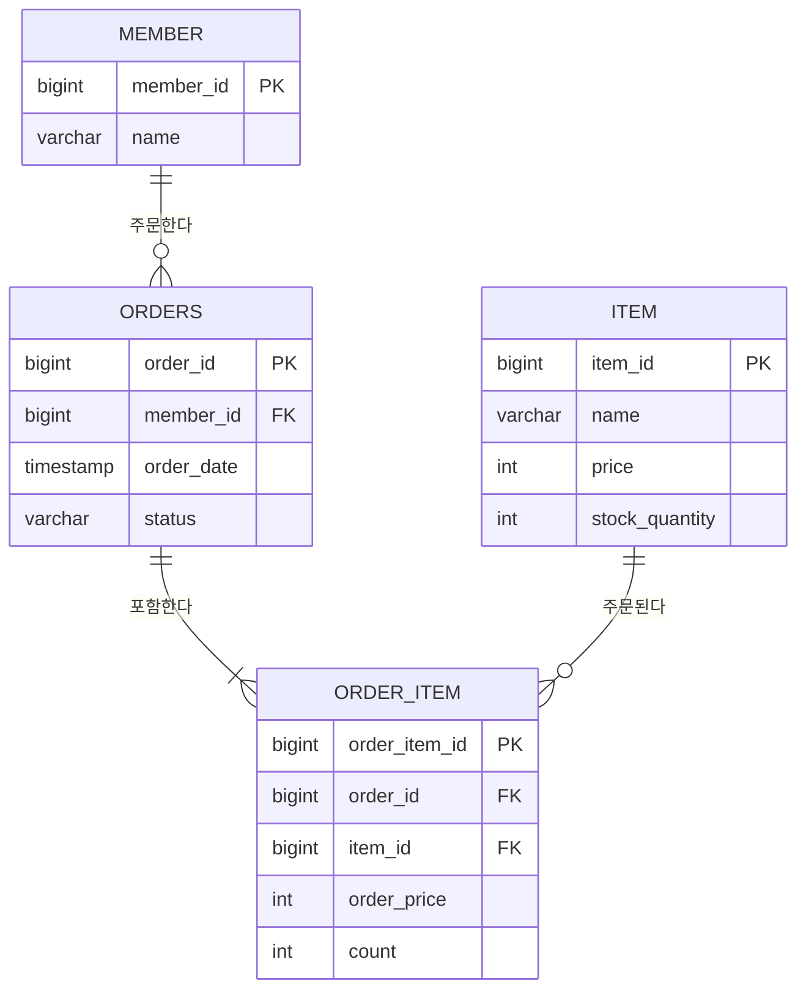

# 2주차 과제 — 김혜원

- 자바 ORM 표준 JPA 프로그래밍 - 기본편(김영한) 中 영속성 컨텍스트 ~ 페치 조인/N+1 파트 수강
- 1차 캐시, 쓰기 지연, 변경 감지(dirty checking) 동작 정리
- 트랜잭션 전파 옵션과 격리 수준별 이상 현상 정리
- N+1이 발생하는 연관관계 매핑을 직접 만들고, 3가지 방식으로 해결한 코드 (주제: 쇼핑몰)
- 격리 수준별 이상 현상 비교표

각 항목의 상세 내용은 아래 문서에 정리했습니다.

- [`docs/persistence-context.md`](docs/persistence-context.md) — 1차 캐시 / 쓰기 지연 / 변경 감지
- [`docs/transaction-isolation.md`](docs/transaction-isolation.md) — 트랜잭션 전파 옵션 / 격리 수준별 이상 현상 / 비교표
- N+1 실습 코드와 해결 3가지는 이 README 아래쪽에 정리했습니다.

---

## 📌 N+1 실습 개요

쇼핑몰 도메인(회원 - 주문 - 주문상품 - 상품)에서 N+1이 발생하는 연관관계를 직접 매핑하고, 테스트로 재현한 뒤 3가지 방법으로 해결했습니다.

- 페치 조인 (`join fetch`)
- `@EntityGraph`
- 배치 사이즈 (`hibernate.default_batch_fetch_size`)

## 🗂 도메인 구조



- `Order`와 `Item`은 N:M 관계(한 주문에 여러 상품, 한 상품이 여러 주문에 포함)라서 중간 엔티티 `OrderItem`으로 풀었습니다. 주문 시점의 가격(`order_price`)을 별도로 저장해서, 이후 상품 가격이 바뀌어도 과거 주문 금액은 그대로 유지되도록 했습니다.
- 연관관계의 주인은 FK를 들고 있는 쪽(`Order.member`, `OrderItem.order`)입니다. `Member.orders`, `Order.orderItems`는 `mappedBy`로 읽기 전용 반대편일 뿐입니다.
- 모든 `@ManyToOne`은 `LAZY`로 설정했습니다. 지금 겪는 N+1은 즉시 로딩(`EAGER`)과는 무관한 문제라서, `EAGER`로 바꿔도 JPQL로 조회하면 N+1이 그대로 발생합니다 (JPQL은 글로벌 fetch 전략을 무시하고 작성된 쿼리 그대로 나간 뒤, 연관 엔티티는 각자 알아서 초기화되기 때문).
- 컬렉션(`Order.orderItems`)은 기본이 `LAZY`이므로 별도 설정을 하지 않았습니다.
- 양쪽 객체 상태가 어긋나지 않도록 연관관계 편의 메서드(`Order.addOrderItem`)를 뒀습니다.

## 🧪 테스트 구조

```
src/test/java/com/tave_2/shop/nplusone/
├── NPlusOneTestSupport        # 공통 데이터(회원 6명, 주문 6건, 주문마다 상품 2종류) + 쿼리 수 측정
├── NPlusOneReproductionTest   # N+1 재현
├── FetchJoinTest               # 해결 1
├── EntityGraphTest             # 해결 2
└── BatchSizeTest                # 해결 3
```

- 눈으로 로그를 세지 않고, Hibernate `Statistics.getPrepareStatementCount()`로 **실행된 쿼리 수를 테스트에서 직접 assert**하도록 만들었습니다.
- `@BeforeEach`에서 데이터를 저장한 뒤 `em.flush()` + `em.clear()`로 1차 캐시를 비웁니다. 비우지 않으면 이후 조회가 1차 캐시에서 바로 반환되어 N+1이 재현되지 않습니다.
- 회원 6명이 각자 주문을 1건씩만 하도록 데이터를 만들었습니다. 한 회원이 여러 번 주문하면 두 번째 주문부터는 같은 회원 엔티티가 1차 캐시에 있어서 추가 쿼리가 안 나가고, N+1이 실제보다 덜 드러나기 때문입니다.

## 🔍 N+1 재현

```java
List<Order> orders = orderRepository.findAll();   // 쿼리 1번

for (Order order : orders) {
    order.getMember().getName();                  // 주문 6건 → 쿼리 6번 추가
}
```

```sql
select ... from orders
select ... from member where member_id = ?   -- x 6
```

`order.getMember()` 자리에는 프록시(가짜 객체)만 들어 있다가, `getName()`을 호출하는 순간 초기화되면서 그제야 SELECT가 나갑니다. `order.getOrderItems()`도 컬렉션이라는 점만 다를 뿐 같은 이유로 1 + N번이 나갑니다.

## ✅ 해결

| 방법 | 코드 | 실행되는 SQL |
|---|---|---|
| 페치 조인 | `@Query("select o from Order o join fetch o.member")` | `orders join member` 1번 |
| `@EntityGraph` | `@EntityGraph(attributePaths = "member")` | `orders left join member` 1번 |
| 배치 사이즈 | `default_batch_fetch_size = 100` | `orders` 1번 + `member where member_id in (...)` 1번 |

### 쿼리 수 비교 (회원 6명 기준)

| | 회원 접근 | 주문상품 접근 |
|---|---|---|
| 해결 전 | 7 (1 + 6) | 7 (1 + 6) |
| 페치 조인 | **1** | **1** |
| `@EntityGraph` | **1** | **1** |
| 배치 사이즈 | **2** | **2** |

### 방법별 특징

- **페치 조인**: JPQL에 `join fetch`를 직접 쓰는 가장 직관적인 방법입니다. 다만 컬렉션(`orderItems`)을 페치 조인하면 결과 행이 늘어나서(주문 6건 → 12행) DB 레벨 페이징(`setFirstResult`/`setMaxResults`)을 쓸 수 없습니다. Hibernate 6부터는 중복 엔티티를 자동으로 걸러주기 때문에 `distinct` 키워드는 필요 없습니다.
- **`@EntityGraph`**: 쿼리 문자열은 그대로 두고, 함께 가져올 연관관계만 어노테이션으로 지정합니다. 내부적으로 `left outer join`을 사용하기 때문에, 연관 엔티티가 없는 데이터(예: 회원 없는 주문)도 결과에서 빠지지 않습니다.
- **배치 사이즈**: 쿼리 코드를 전혀 바꾸지 않아도 되고, 컬렉션 조회에서도 페이징을 그대로 쓸 수 있습니다(컬렉션 자체는 페치 조인하지 않으니까요). 대신 쿼리가 1번이 아니라 2번(원본 조회 + 배치 IN 조회) 나갑니다.
  - `application.yaml`에 전역으로 켜두면 N+1 재현 테스트(`NPlusOneReproductionTest`)까지 통과해버려서, 이 프로젝트에서는 `BatchSizeTest`에만 `@TestPropertySource`로 켰습니다. 실무에서는 보통 전역 설정(`spring.jpa.properties.hibernate.default_batch_fetch_size`, 100~1000 권장)으로 적용합니다.

**정리**: `ManyToOne`(회원)처럼 결과 행이 늘어나지 않는 단건 연관관계는 페치 조인이나 `@EntityGraph` 둘 다 무난하고, 컬렉션(주문상품)처럼 행이 늘어나서 페이징이 필요한 경우는 배치 사이즈 조합이 더 안전하다고 판단했습니다.

## 실행 방법

```bash
./gradlew test
```

H2 인메모리 DB를 사용하므로 별도 설정 없이 바로 실행됩니다. `application.yaml`에서 `org.hibernate.SQL: debug`로 SQL 로그를 확인할 수 있습니다.
